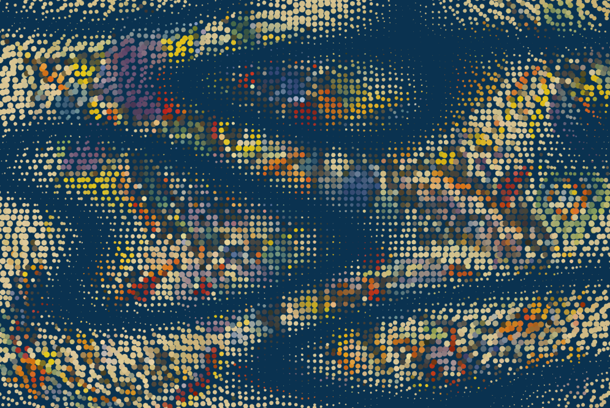

###Final Concept
When I was studying art history in college, I was always wondering I could have a kinetic painting where the look and feel of the paiting would morph from time to time so it wouldn't always look the same on the wall.  

So for my final project, I'm intending to recreate one of my favorite paitings by using multiple techniques we have learned over the semester, such as image processing, perlin noise, mesh, particles, force simulation, etc. to create a dynamic abstract paitinng that changes over time.

The final project could be the visual component for the kinetic digital painting.  

Here is a sample of one state of the painting:

