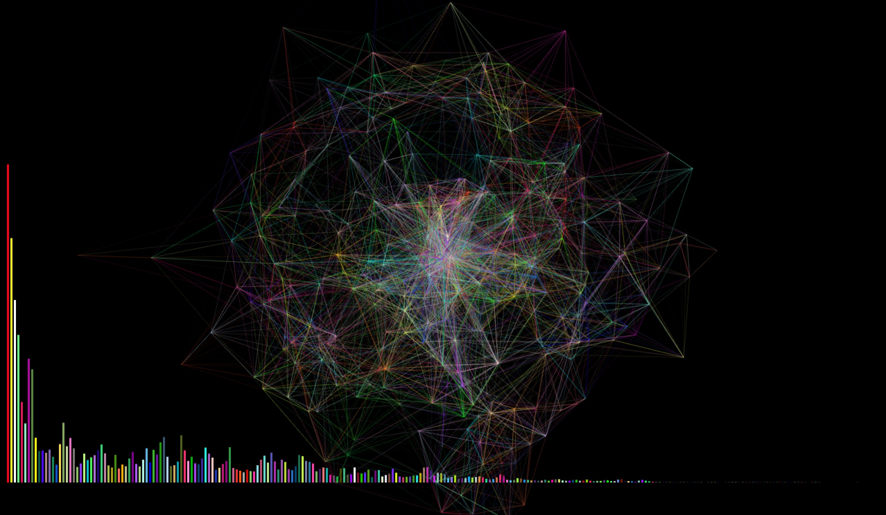

###Week 1
The first week was fine. I think my main trouble was with the shaper function. 
Also I had trouble understanding what the third question was about...

###Week 2
I'm proud that I successfully did the simulation of the crystalls on window 
But I had trouble understaind what the thrid questions was asking us to do

###Week 3
I don't know why my second one is not running. I'm trying to make a triagle bush where all the triangles are pointing towards the center of the canvas and moving as a spiral at the same time

###Week 4
Adding force creatively to my work is a challenge. I'm still experimenting with it so that I can add force to the animation that does not involve mouse position. rather the force is part of the animation by itself. 

###Midterm 
a sound visualizer 

The shape is inspired by the sphere we did in class in 2nd week. 

visual inspiration:

http://www.harmogram.com/

